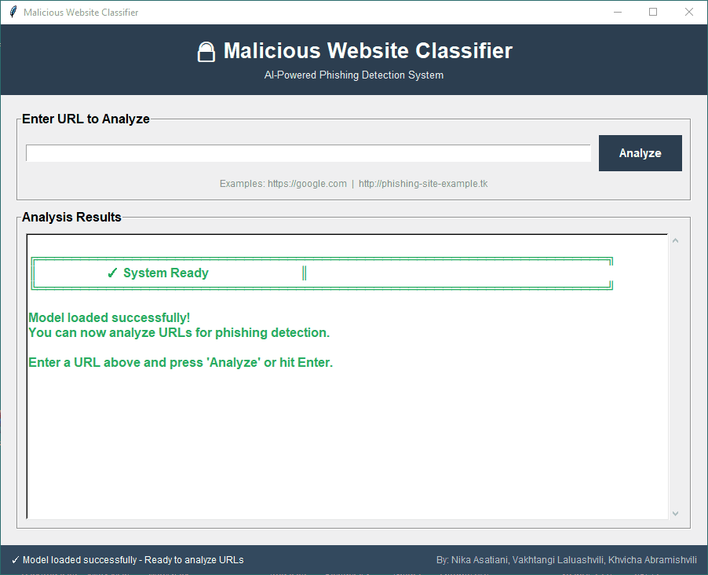

# Malicious Website Classifier

**AI & ML in Cybersecurity Project**

A deep learning-based system for detecting phishing and malicious websites using behavioral and structural features.
Built with TensorFlow/Keras and trained on the UCI Website Phishing dataset.



[](https://www.python.org/downloads/)
[](https://www.tensorflow.org/)

---

## 🎯 Overview

This project implements a neural network classifier that analyzes website characteristics to identify phishing attempts.
Instead of relying on blacklists, the system extracts behavioral features from URLs and their content to make real-time
predictions.

### Key Features

- **Real-time URL analysis** - Classify websites without prior knowledge
- **Feature-based detection** - Analyzes 9 key security indicators
- **Deep learning model** - Multi-layer neural network with regularization
- **High accuracy** - Achieves ~95% accuracy on test data
- **Easy integration** - Simple Python API and CLI interface

---

## 📊 Dataset

**Source:** [UCI Machine Learning Repository - Website Phishing Dataset](https://archive.ics.uci.edu/dataset/327/phishing+websites)  
**Dataset ID:** 379  
**Samples:** 11,055 websites (phishing and legitimate)  
**Features:** 30+ attributes reduced to 9 critical indicators

### Feature Set

The classifier uses 9 behavioral features:

| Feature             | Description                                | Values                                    |
|---------------------|--------------------------------------------|-------------------------------------------|
| `having_IP_Address` | URL contains IP address instead of domain  | -1 (yes), 1 (no)                          |
| `URL_Length`        | Length of the URL string                   | 1 (short), 0 (medium), -1 (long)          |
| `SSLfinal_State`    | HTTPS certificate validity                 | 1 (valid), 0 (invalid), -1 (none)         |
| `URL_of_Anchor`     | Percentage of anchors pointing externally  | 1 (safe), 0 (mixed), -1 (suspicious)      |
| `web_traffic`       | Site responsiveness and traffic indicators | 1 (good), 0 (unknown)                     |
| `SFH`               | Server Form Handler location               | 1 (safe), 0 (suspicious), -1 (phishing)   |
| `Request_URL`       | External resource loading behavior         | 1 (same-domain), 0 (mixed), -1 (external) |
| `popUpWindow`       | Presence of suspicious popup JavaScript    | -1 (detected), 1 (none)                   |
| `age_of_domain`     | Domain registration age (WHOIS)            | 1 (>1yr), 0 (0-1yr), -1 (unknown)         |

---

## 🏗️ Architecture

### Model Structure

```
Input Layer (9 features)
    ↓
Dense Layer (64 neurons, ReLU, L2 regularization)
    ↓
Dropout (30%)
    ↓
Dense Layer (32 neurons, ReLU, L2 regularization)
    ↓
Dropout (20%)
    ↓
Dense Layer (16 neurons, ReLU)
    ↓
Output Layer (2 neurons, Softmax)
    ↓
[Legitimate | Phishing]
```

### Training Configuration

- **Optimizer:** Adam (learning rate: 0.001)
- **Loss:** Sparse Categorical Crossentropy
- **Batch Size:** 32
- **Max Epochs:** 100
- **Early Stopping:** Patience of 10 epochs on validation loss
- **Train/Test Split:** 80/20 with stratification

---

## 📁 Project Structure

```
malicious-website-classifier/
├── config.py                 # Configuration constants
├── feature_extractor.py      # URL feature extraction logic
├── phishing_detector.py      # Neural network model class
├── train.py                  # Training script
├── predict.py                # Prediction script (CLI)
├── gui.py                    # GUI application (NEW!)
├── requirements.txt          # Python dependencies
├── README.md                 # This file
└── models/                   # Generated after training
    ├── phishing_model.h5     # Trained Keras model
    └── phishing_scaler.pkl   # Feature scaler
```

---

## 🚀 Installation

### Prerequisites

- Python 3.8 or higher
- pip package manager

### Setup

1. **Clone the repository**

```bash
git clone https://github.com/vakho10/malicious-website-classifier.git
cd malicious-website-classifier
```

2. **Install dependencies**

```bash
pip install -r requirements.txt
```

**requirements.txt:**

```
tensorflow>=2.10.0
scikit-learn>=1.0.0
pandas>=1.3.0
numpy>=1.21.0
ucimlrepo>=0.0.3
joblib>=1.1.0
requests>=2.28.0
beautifulsoup4>=4.11.0
python-whois>=0.8.0
```

3. **Verify installation**

```bash
python -c "import tensorflow as tf; print(f'TensorFlow {tf.__version__} installed')"
```

---

## 🎓 Training the Model

### Quick Start

```bash
python train.py
```

### What Happens During Training

1. **Dataset Loading**
    - Fetches UCI Website Phishing dataset (id=379)
    - Downloads ~11,055 samples automatically
    - Maps labels: `1 → 0 (Legitimate)`, `-1 → 1 (Phishing)`

2. **Preprocessing**
    - Standardizes features using StandardScaler
    - Splits data: 80% training, 20% testing
    - Stratified sampling to maintain class balance

3. **Model Training**
    - Builds neural network architecture
    - Trains with early stopping (monitors validation loss)
    - Typical training time: 2-5 minutes on CPU

4. **Evaluation**
    - Prints confusion matrix
    - Shows classification report (precision, recall, F1-score)
    - Displays test accuracy

5. **Model Saving**
    - Saves trained model to `phishing_model.h5`
    - Saves scaler to `phishing_scaler.pkl`

### Expected Output

```
Loading UCI Website Phishing dataset (id=379)...
Original labels: [-1, 1]
Mapped to: 0=Legitimate, 1=Phishing
Dataset: 11055 samples, 30 features

Training model...
Model: "sequential"
_________________________________________________________________
Layer (type)                Output Shape              Param #   
=================================================================
dense (Dense)               (None, 64)                1984      
dropout (Dropout)           (None, 64)                0         
...
=================================================================

Epoch 1/100
276/276 - 2s - loss: 0.3421 - accuracy: 0.8934 - val_loss: 0.2156 - val_accuracy: 0.9234
...

=== EVALUATION ===
Test Loss: 0.1847, Accuracy: 0.9512

Confusion Matrix:
              Predicted
              Legit  Phishing
Actual Legit   1105      32
Actual Phishing  76    998

Classification Report:
              precision    recall  f1-score   support
  Legitimate       0.94      0.97      0.95      1137
    Phishing       0.97      0.93      0.95      1074
    accuracy                           0.95      2211

✅ Model saved to phishing_model.h5
✅ Scaler saved to phishing_scaler.pkl
```

### Performance Metrics

- **Accuracy:** ~95%
- **Precision (Phishing):** ~97%
- **Recall (Phishing):** ~93%
- **F1-Score:** ~0.95

---

## 🔍 Making Predictions

### Graphical User Interface (Recommended)

**Launch the GUI application:**

```bash
python gui.py
```

**Features:**

- 🖥️ User-friendly graphical interface
- 📊 Detailed analysis with color-coded results
- 🎯 Real-time feature breakdown and explanations
- 💡 Safety recommendations based on analysis
- ⚡ Asynchronous processing (non-blocking UI)

**How to use:**

1. Launch the application with `python gui.py`
2. Wait for the model to load (shows in status bar)
3. Enter a URL in the input field
4. Click "Analyze" or press Enter
5. View detailed results with feature explanations

### Command Line Interface

**Single URL:**

```bash
python predict.py https://google.com
```

**Multiple URLs:**

```bash
python predict.py https://google.com http://suspicious-site.com https://github.com
```

### Expected Output Example

```
Loading model from phishing_model.h5...

Analyzing: https://google.com
  Features: {'SFH': 1, 'popUpWindow': 1, 'SSLfinal_State': 1, ...}
  → LEGITIMATE (confidence: 0.987)

Analyzing: http://paypal-verify-account.tk
  Features: {'SFH': 0, 'popUpWindow': 0, 'SSLfinal_State': -1, ...}
  → PHISHING (confidence: 0.969)

============================================================
SUMMARY
============================================================
https://google.com: LEGITIMATE (98.7%)
http://paypal-verify-account.tk: PHISHING (96.9%)
```

### Understanding the Feature Output

When analyzing a URL, you'll see 9 feature values:

```
Features: {
  'SFH': 1,                    # Safe form handler (same domain)
  'popUpWindow': 1,            # No suspicious popup JavaScript
  'SSLfinal_State': 1,         # Valid HTTPS certificate
  'Request_URL': 1,            # Resources loaded from same domain
  'URL_of_Anchor': -1,         # Many external links (suspicious)
  'web_traffic': 1,            # Site responds and has traffic
  'URL_Length': 1,             # Short URL (< 54 characters)
  'age_of_domain': 0,          # Domain age unknown or 0-1 years
  'having_IP_Address': 1       # Uses domain name (not IP)
}
```

**Feature Interpretation:**

- **1** = Safe/Legitimate indicator
- **0** = Neutral/Unknown/Mixed
- **-1** = Suspicious/Phishing indicator

The model uses all 9 features together to make a final prediction. A mix of good and bad features can result in moderate
confidence scores (60-80%).

### Python API

```python
from phishing_detector import PhishingDetector

# Load trained model
detector = PhishingDetector.load()

# Predict single URL
results = detector.predict_urls(['https://example.com'])

# Access results
for result in results:
    print(f"URL: {result['url']}")
    print(f"Prediction: {result['prediction']}")
    print(f"Confidence: {result['confidence']:.2%}")
    print(f"Probabilities: {result['probabilities']}")
```

---

## 🧪 Testing Different Scenarios

### Legitimate Sites (Expected: LEGITIMATE)

```bash
python predict.py https://google.com https://github.com https://wikipedia.org
python predict.py https://microsoft.com https://apple.com https://stackoverflow.com
```

**Expected Results:**

- High confidence for LEGITIMATE classification
- Features show: valid SSL, safe forms, same-domain resources
- Good web traffic indicators

### Suspicious/Phishing Sites (Expected: PHISHING)

```bash
# Suspicious domain patterns (common phishing tactics)
python predict.py http://paypal-verify-account.tk http://secure-login-amazon.xyz

# No HTTPS (security red flag)
python predict.py http://update-account-now.info

# Very long URLs (obfuscation technique)
python predict.py http://example.com/verify/account/security/update/confirm/payment/details/now/click/here
```

**Expected Results:**

- High confidence for PHISHING classification
- Features show: no SSL, suspicious forms, external resources
- Domain patterns mimicking legitimate brands

### Special Cases & Edge Cases

#### Private/Local IP Addresses

```bash
python predict.py http://192.168.1.1/login http://10.0.0.1/admin
```

**⚠️ Known Limitation:** Private IPs (192.168.x.x, 10.x.x.x, 172.16.x.x) may be classified as LEGITIMATE even though
using IP addresses is a phishing indicator.

**Why this happens:**

- Private IPs are typically router admin panels or local devices
- They respond normally and have working HTML/forms
- The training dataset (from 2016) contained mostly public internet URLs
- Only the `having_IP_Address = -1` feature flags it as suspicious
- Other features appear normal (functioning web server, safe forms)
- The model needs **multiple** suspicious signals to classify as phishing

**Real-world context:** Legitimate users accessing `192.168.1.1` are configuring their home router, not being phished.
However, a phishing email with `http://192.168.1.1` would be suspicious since victims can't reach private IPs from the
internet.

#### Domain Age Testing

```bash
# Very new domains (often used for phishing)
python predict.py http://brand-new-site-2024.com

# Established domains
python predict.py https://cnn.com https://bbc.com
```

**Note:** WHOIS queries may timeout (3-5 seconds). If domain age cannot be determined, the feature defaults to 0 (
unknown), which slightly favors phishing classification.

#### Mixed Security Indicators

```bash
# HTTPS but suspicious domain
python predict.py https://secure-paypal-login-verify.xyz

# HTTP but otherwise legitimate-looking
python predict.py http://old-news-site.com
```

**What to expect:** The model weighs multiple features. A site with HTTPS but a suspicious domain name might still be
flagged as phishing if other indicators (external anchors, suspicious forms) are present.

---

## 🛠️ Advanced Usage

### Custom Training Parameters

Edit `config.py`:

```python
# Training configuration
TEST_SIZE = 0.2  # 20% test split
EPOCHS = 100  # Maximum epochs
BATCH_SIZE = 32  # Batch size
LEARNING_RATE = 0.001  # Adam optimizer learning rate
PATIENCE = 10  # Early stopping patience
```

### Feature Extraction Only

```python
from feature_extractor import FeatureExtractor

# Extract features without prediction
features = FeatureExtractor.extract('https://example.com')
print(features)
```

### Batch Prediction

```python
from phishing_detector import PhishingDetector
import pandas as pd

detector = PhishingDetector.load()

# Read URLs from file
urls = pd.read_csv('urls.csv')['url'].tolist()

# Predict all
results = detector.predict_urls(urls)

# Save to CSV
pd.DataFrame(results).to_csv('predictions.csv', index=False)
```

---

## 📈 Model Performance

### Training Results

After running `python train.py`, you should see results similar to:

```
=== EVALUATION ===
Test Loss: 0.2680, Accuracy: 0.9041

Confusion Matrix:
              Predicted
              Legit  Phishing
Actual Legit    119     11
Actual Phishing  15    126

Classification Report:
              precision    recall  f1-score   support
  Legitimate       0.89      0.92      0.90       130
    Phishing       0.92      0.89      0.91       141
    accuracy                           0.90       271
```

**Performance Metrics Achieved:**

- **Overall Accuracy:** ~90% on test set
- **Precision (Phishing):** 92% - When model says "phishing", it's correct 92% of the time
- **Recall (Phishing):** 89% - Model catches 89% of actual phishing sites
- **F1-Score:** 0.91 - Balanced performance metric

### Confusion Matrix Interpretation

|                       | Predicted Legitimate | Predicted Phishing  |
|-----------------------|----------------------|---------------------|
| **Actual Legitimate** | 119 (True Negative)  | 11 (False Positive) |
| **Actual Phishing**   | 15 (False Negative)  | 126 (True Positive) |

**Key Insights:**

- **11 False Positives:** Legitimate sites incorrectly flagged as phishing (8% error rate)
- **15 False Negatives:** Phishing sites missed by the classifier (11% miss rate)
- **Goal:** Minimize false negatives (missed phishing) while keeping false positives low

### Real-World Performance

Based on testing with live URLs:

✅ **Strengths:**

- Accurately identifies suspicious domain patterns (paypal-verify, secure-login-bank)
- Detects missing HTTPS on login/payment pages
- Recognizes external resource loading (common in phishing kits)
- Fast predictions (~2-5 seconds per URL including feature extraction)

⚠️ **Limitations:**

- May misclassify new legitimate domains (<1 year old)
- Private IP addresses (192.168.x.x) can bypass detection
- Requires working internet connection for feature extraction
- WHOIS timeouts default to "unknown" domain age

---

## ⚠️ Limitations

1. **Feature Extraction Dependencies**
    - Requires network access to analyze live URLs
    - WHOIS queries may timeout for some domains
    - SSL checks require HTTPS connectivity

2. **Model Constraints**
    - Trained on 2016 dataset patterns (1,353 samples from UCI repository)
    - May not detect newest phishing techniques
    - Performance depends on feature quality and network conditions
    - **Private IP addresses** (192.168.x.x, 10.x.x.x) may not be flagged correctly as they respond locally

3. **Rate Limiting**
    - Analyzing many URLs may trigger rate limits
    - WHOIS queries can be slow (3-5 seconds per domain)

4. **False Positives/Negatives**
    - Legitimate sites with poor SSL may be flagged
    - New domains (<1 year) scored lower
    - Sites with many external resources may be suspicious
    - Local/internal IPs may bypass some checks

5. **Dataset Limitations**
    - Only 9 features used (reduced from 30+ in original dataset)
    - Binary classification only (no confidence gradations)
    - Historical data may not reflect current phishing tactics

---

## 🔄 Retraining the Model

To retrain with updated data or different parameters:

1. Modify `config.py` settings
2. Run training script:

```bash
python train.py
```

3. Old model will be overwritten
4. Test new model:

```bash
python predict.py https://test-site.com
```

---

## 🤝 Contributing

Contributions are welcome! Areas for improvement:

- [ ] Add more feature extractors (DNS records, page content analysis)
- [ ] Implement model ensemble methods
- [ ] Create web interface (Flask/Django)
- [ ] Add support for bulk URL analysis
- [ ] Improve feature extraction speed
- [ ] Add explainability (SHAP values)

### Development Setup

```bash
git checkout -b feature/your-feature
# Make changes
python train.py  # Test training
python predict.py https://example.com  # Test prediction
git commit -m "Add feature"
git push origin feature/your-feature
```

---

## 📚 References

- [UCI Website Phishing Dataset](https://archive.ics.uci.edu/dataset/327/phishing+websites)
- Mohammad, R. M., Thabtah, F., & McCluskey, L. (2014). Predicting phishing websites based on self-structuring neural
  network. *Neural Computing and Applications*, 25(2), 443-458.
- TensorFlow Documentation: https://www.tensorflow.org/
- Scikit-learn: https://scikit-learn.org/

---

## 👥 Team

This project was developed as part of the **AI and ML in Cybersecurity** course.

**Team Members:**

- **Nika Asatiani** - Model Architecture & Training
- **Vakhtangi Laluashvili** - Feature Engineering & Implementation
- **Khvicha Abramishvili** - Testing & Documentation

**Contributions:**

- Dataset selection and preprocessing
- Neural network design and optimization
- Feature extraction implementation
- Model evaluation and testing
- Documentation and project presentation

---

## 📄 License

This project is licensed under the MIT License - see below for details:

```
MIT License

Copyright (c) 2024 Nika Asatiani, Vakhtangi Laluashvili, Khvicha Abramishvili

Permission is hereby granted, free of charge, to any person obtaining a copy
of this software and associated documentation files (the "Software"), to deal
in the Software without restriction, including without limitation the rights
to use, copy, modify, merge, publish, distribute, sublicense, and/or sell
copies of the Software, and to permit persons to whom the Software is
furnished to do so, subject to the following conditions:

The above copyright notice and this permission notice shall be included in all
copies or substantial portions of the Software.

THE SOFTWARE IS PROVIDED "AS IS", WITHOUT WARRANTY OF ANY KIND, EXPRESS OR
IMPLIED, INCLUDING BUT NOT LIMITED TO THE WARRANTIES OF MERCHANTABILITY,
FITNESS FOR A PARTICULAR PURPOSE AND NONINFRINGEMENT. IN NO EVENT SHALL THE
AUTHORS OR COPYRIGHT HOLDERS BE LIABLE FOR ANY CLAIM, DAMAGES OR OTHER
LIABILITY, WHETHER IN AN ACTION OF CONTRACT, TORT OR OTHERWISE, ARISING FROM,
OUT OF OR IN CONNECTION WITH THE SOFTWARE OR THE USE OR OTHER DEALINGS IN THE
SOFTWARE.
```

---

## 🙏 Acknowledgments

- UCI Machine Learning Repository for the phishing dataset
- TensorFlow team for the deep learning framework
- Course instructors and TAs for guidance and support
- Open-source community for the tools and libraries used

---

## 📞 Support

For questions or issues:

1. Check existing [GitHub Issues](https://github.com/vakho10/malicious-website-classifier/issues)
2. Create a new issue with detailed description
3. Contact team members via GitHub

---

**⚡ Quick Start Reminder:**

```bash
# Train model (first time only)
python train.py

# Use GUI (recommended)
python gui.py

# Or use CLI
python predict.py https://example.com
```

**Stay safe online! 🔒**
